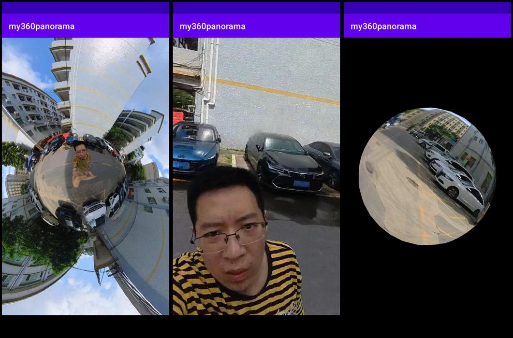

# 360°安卓全景

本项目为Android Studio下工程文件，已实现全景图片，视频的实时拼接和渲染，还支持手动交互，陀螺仪控制视角！



---

<https://github.com/user-attachments/assets/76ca11f9-a708-490e-a1dc-4d3a3366bf82>

<https://github.com/user-attachments/assets/55c13876-425a-4134-ba18-b155dffd6f80>

<https://github.com/user-attachments/assets/a9a48473-b877-4c66-89ab-905f075b2ace>

---

*本项目中的ffmpeg预编译so库来源于仓库<https://github.com/bookzhan/bzijkPlayer>,较新的ffmpeg预编译库可以参考 <https://github.com/xufuji456/FFmpegAndroid>，但目前集成新的较为困难，依旧使用的是bzijkplayer*.

## Dependencies

- [bzijkPlayer](https://github.com/bookzhan/bzijkPlayer)版本：

```text
===== versions =====<br>
ijkplayer    : 0.8.8 <br>
FFmpeg       : ff3.4--ijk0.8.7--20180103--001<br>
libavutil    : 55.78.100<br>
libavcodec   : 57.107.100<br>
libavformat  : 57.83.100<br>
libswscale   : 4.8.100<br>
libswresample: 2.9.100<br>
```

- [OpenCV](https://opencv.org/)
- [ffmpeg](https://ffmpeg.org/)
- OpenGL ES 3.0

## 功能

关于与insta360 x3产品功能对标，我们将逐一对标，并列出对标的功能点。更多详细信息请参考[360全景产品对标](./insta360.md)。
